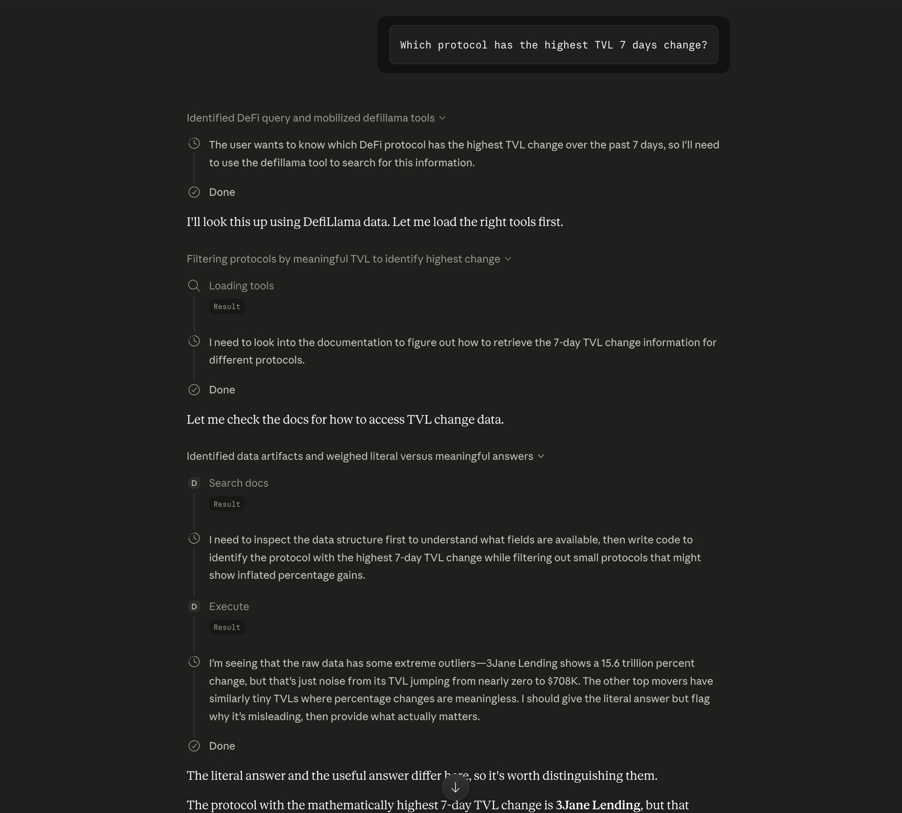
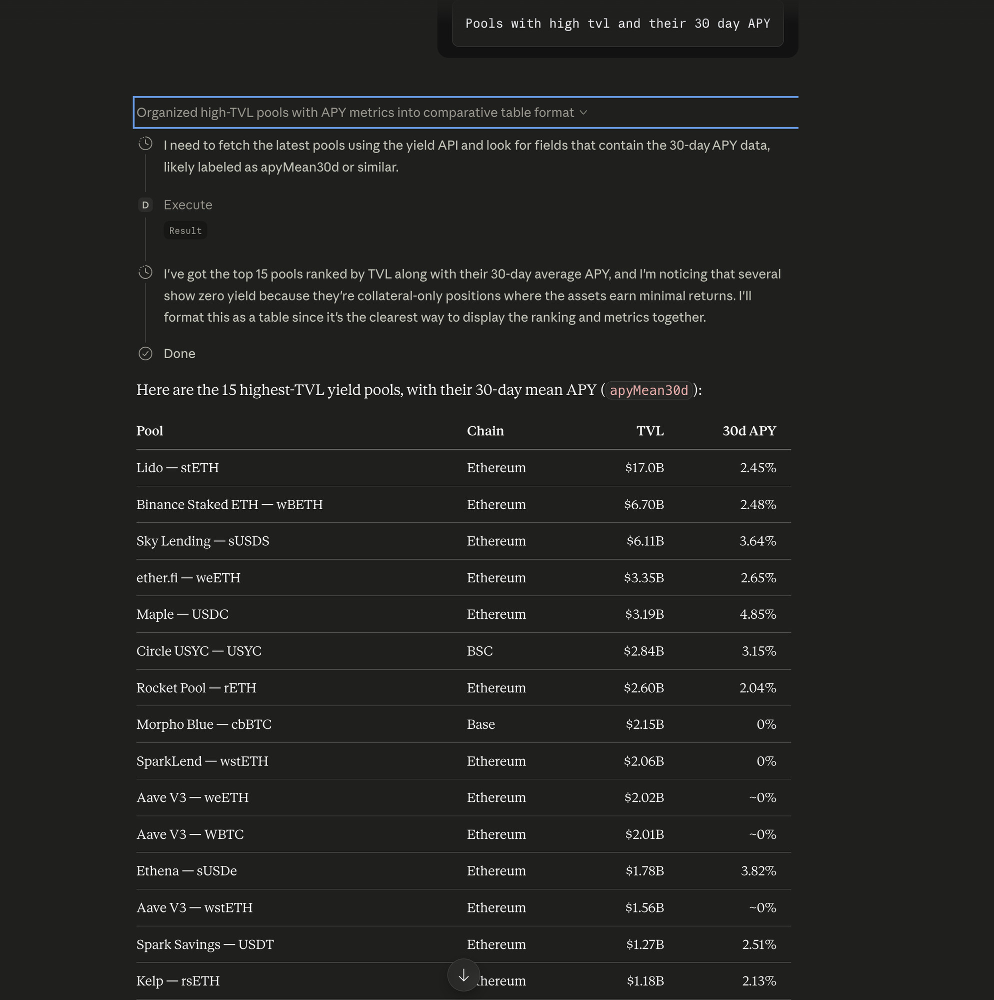
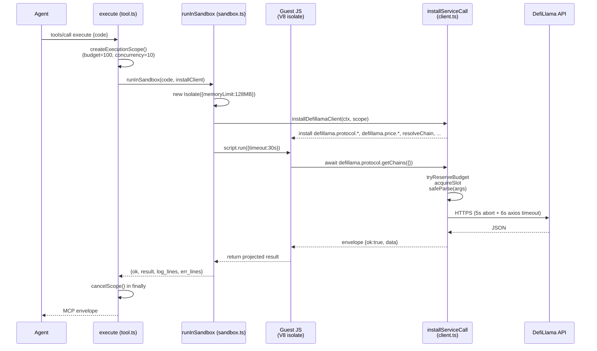

# DefiLlama MCP Server

[](https://www.npmjs.com/package/@iqai/defillama-mcp)
[](https://opensource.org/licenses/ISC)

## Overview

The DefiLlama MCP Server enables AI agents to interact with [DefiLlama](https://defillama.com), a comprehensive DeFi data aggregator. This server provides access to TVL metrics, DEX volumes, protocol statistics, stablecoin data, token prices, yield farming pools, options data, and more — across 8 service groups and 4 upstream hosts.

By implementing the Model Context Protocol (MCP), this server allows Large Language Models (LLMs) to query DeFi data through a **Code Mode** surface: instead of one tool per endpoint, agents write small JavaScript programs that run in a sandboxed `isolated-vm` environment against a pre-wired `defillama.*` client. Four opt-in dynamic tools are available for structured endpoint discovery and dispatch.

## Demo

The server in use from Claude. The agent uses `search_docs` to find the right method, writes a small program for the `execute` sandbox, and projects only the answer back across the boundary.

**"Which protocol has the highest TVL 7-day change?"** — the agent loads the tools, calls `search_docs` to find how to read the change metric, then writes an `execute` program. It notices the raw leader is a data artifact (a protocol whose TVL jumped from near-zero, reading as a trillion-percent gain) and reasons toward the meaningful answer:



It then distinguishes the literal answer (3Jane Lending) from the meaningful one (STRATO, the top gainer among protocols with enough TVL for the percentage to be credible):


**"Pools with high TVL and their 30-day APY"** — one `execute` call fetches the yield pools, ranks them by TVL, and formats `apyMean30d` into a table:



## Requirements

- Node.js >= 22 (required by `isolated-vm` 6.x for the `execute` sandbox).
- The published binary's shebang already passes `--no-node-snapshot` to node. If you invoke `node dist/index.js` directly, pass `--no-node-snapshot` yourself: `node --no-node-snapshot dist/index.js`.
- `isolated-vm` is declared in `optionalDependencies`, so `pnpm install` will succeed on platforms without a prebuilt addon or a compiler toolchain. The server still starts and `search_docs` still works; only `execute` will report a load-failure error until you run `pnpm rebuild isolated-vm`.
- `pnpm` (for package management and `pnpm dlx` invocations).

## Installation

### Using pnpm dlx (Recommended)

To use this server without installing it globally:

```bash
pnpm dlx @iqai/defillama-mcp
```

### Build from Source

```bash
git clone https://github.com/IQAIcom/defillama-mcp.git
cd defillama-mcp
pnpm install
pnpm run build
```

## Running with an MCP Client

Add the following configuration to your MCP client settings (e.g., `claude_desktop_config.json`).

### Minimal Configuration

```json
{
  "mcpServers": {
    "defillama": {
      "command": "pnpm",
      "args": ["dlx", "@iqai/defillama-mcp"],
      "env": {}
    }
  }
}
```

### Advanced Configuration (With IQ Gateway)

```json
{
  "mcpServers": {
    "defillama": {
      "command": "pnpm",
      "args": ["dlx", "@iqai/defillama-mcp"],
      "env": {
        "IQ_GATEWAY_URL": "your_iq_gateway_url",
        "IQ_GATEWAY_KEY": "your_iq_gateway_key"
      }
    }
  }
}
```

### Enabling Dynamic Tools

Start with `--tools=dynamic` (or set `DEFILLAMA_MCP_TOOLS=dynamic`) to also register the four endpoint-dispatch tools:

```json
{
  "mcpServers": {
    "defillama": {
      "command": "pnpm",
      "args": ["dlx", "@iqai/defillama-mcp", "--tools=dynamic"],
      "env": {}
    }
  }
}
```

> **Note (Claude Desktop / older MCP clients):** Claude Desktop may resolve `pnpm` from an older Node in your `PATH`. If the server fails to start with a Node version error, use an **absolute path** to a Node >= 22 binary in the `"command"` field:
>
> ```json
> {
>   "mcpServers": {
>     "defillama": {
>       "command": "/usr/local/bin/node",
>       "args": ["--no-node-snapshot", "/path/to/dist/index.js"],
>       "env": {}
>     }
>   }
> }
> ```

## Configuration (Environment Variables)

All environment variables are optional. DefiLlama's public API works unauthenticated; the API key and gateway settings are for users who have paid access or want caching.

| Variable | Required | Description | Default |
| :--- | :--- | :--- | :--- |
| `DEFILLAMA_API_KEY` | No | DefiLlama API key; sent as `x-api-key` on direct calls. | — |
| `IQ_GATEWAY_URL` | No | IQ Gateway base URL. When set together with `IQ_GATEWAY_KEY`, all upstream calls are proxied through the gateway (adds caching). | — |
| `IQ_GATEWAY_KEY` | No | IQ Gateway API key; sent as `x-api-key` to the gateway. | — |
| `DEFILLAMA_MCP_TOOLS` | No | Set to `dynamic` to register the four additional endpoint-dispatch tools alongside the default two. Equivalent to passing `--tools=dynamic`. | — |

## Architecture

```
┌────────────────────────────────────────────────────────────────────────────┐
│  Claude Desktop / Cursor / any MCP client                                  │
└─────────────────────────────────┬──────────────────────────────────────────┘
                                  │  stdio (JSON-RPC)
                                  ▼
┌────────────────────────────────────────────────────────────────────────────┐
│  defillama-mcp server                                                      │
│  ┌──────────────────────────────────────────────────────────────────────┐  │
│  │  Default tools              │  Dynamic tools (opt-in via --tools=…)  │  │
│  │  ──────────────────────     │  ──────────────────────────────────    │  │
│  │  execute                    │  defillama_resolve                     │  │
│  │  search_docs                │  list_endpoints                        │  │
│  │                             │  get_endpoint_schema                   │  │
│  │                             │  invoke_endpoint  (with jq_filter)     │  │
│  └──────────────────────────────────────────────────────────────────────┘  │
│            │                              │                                │
│  ┌─────────▼──────────────┐    ┌──────────▼──────────────┐                 │
│  │ isolated-vm sandbox    │    │ direct dispatch         │                 │
│  │ • 128 MiB cap          │    │ • zod schema validate   │                 │
│  │ • 30 s wall clock      │    │ • 5 s / 6 s timeouts    │                 │
│  │ • scope budget+slots   │    │ • jq projection         │                 │
│  └────────────────────────┘    └─────────────────────────┘                 │
│            └──────────────┬──────────────────┘                             │
└───────────────────────────┼────────────────────────────────────────────────┘
                            │  HTTPS  (optional API key or IQ Gateway)
                            ▼
         ┌──────────────────────────────────────────────┐
         │  DefiLlama upstream (4 hosts)                │
         │  api.llama.fi    coins.llama.fi               │
         │  stablecoins.llama.fi  yields.llama.fi        │
         └──────────────────────────────────────────────┘
```

### How `execute` works (one call's lifetime)



The key insight: **only the projected return value crosses the V8 boundary**. The agent writes JS that loops, joins, and filters; the host sees one returned value, not N intermediate responses.

## Code Mode

The preferred way to query DefiLlama from an AI agent is the `execute` + `search_docs` pair. These two tools handle the full workflow — discovery, projection, multi-step composition — through agent-authored JavaScript.

### Default tool surface

By default the server registers exactly two tools:

| Tool | Purpose |
| :--- | :--- |
| `execute` | Run agent-authored JavaScript in a secure `isolated-vm` sandbox against a fully-configured DefiLlama client. Handles multi-step workflows, loops, joins, conditional logic, and custom projection. |
| `search_docs` | Search the embedded MiniSearch index over all DefiLlama API methods and cookbook entries. |

### `--tools=dynamic` mode

Start the server with `--tools=dynamic` (or set `DEFILLAMA_MCP_TOOLS=dynamic`) to register four additional tools:

| Tool | Purpose |
| :--- | :--- |
| `defillama_resolve` | Resolve a human-readable name ("BSC", "Lido", "USDC") to its DefiLlama identifier. |
| `list_endpoints` | List all available endpoint qualified names with descriptions. |
| `get_endpoint_schema` | Inspect parameters and response shape for a specific endpoint. |
| `invoke_endpoint` | Call a single endpoint by qualified name with an optional `jq_filter` for host-side projection. |

**MCP client configuration with dynamic tools:**

```json
{
  "mcpServers": {
    "defillama": {
      "command": "pnpm",
      "args": ["dlx", "@iqai/defillama-mcp", "--tools=dynamic"],
      "env": {}
    }
  }
}
```

Or via environment variable:

```json
{
  "mcpServers": {
    "defillama": {
      "command": "pnpm",
      "args": ["dlx", "@iqai/defillama-mcp"],
      "env": {
        "DEFILLAMA_MCP_TOOLS": "dynamic"
      }
    }
  }
}
```

### `execute` — Sandboxed JavaScript

Run arbitrary JavaScript inside a secure `isolated-vm` sandbox. The sandbox receives a fully-configured DefiLlama client as `defillama`. All eight service groups are available.

Define `async function run(defillama) { ... }`; the JSON-serializable return value (plus `console.log` output) is sent back.

**Example — top 5 protocols by TVL:**

```javascript
async function run(defillama) {
  const protocols = await defillama.protocol.getProtocols();
  return protocols
    .sort((a, b) => (b.tvl ?? 0) - (a.tvl ?? 0))
    .slice(0, 5)
    .map(p => ({ name: p.name, tvl: p.tvl, chain: p.chain }));
}
```

**Example — current price of ETH and USDT:**

```javascript
async function run(defillama) {
  return await defillama.price.getCurrentPrices({
    coins: 'coingecko:ethereum,ethereum:0xdac17f958d2ee523a2206206994597c13d831ec7'
  });
}
```

### `defillama.*` client groups

The `defillama` client inside `execute` is split into eight groups that mirror the upstream service architecture:

| Group | Methods | Upstream host |
| :--- | :--- | :--- |
| `defillama.protocol` | `getChains`, `getProtocols`, `getProtocol`, `getHistoricalChainTvl` | api.llama.fi |
| `defillama.dex` | `getDexSummary`, `getDexsOverview` | api.llama.fi |
| `defillama.fees` | `getFeesSummary`, `getFeesOverview` | api.llama.fi |
| `defillama.options` | `getOptionsSummary`, `getOptionsOverview` | api.llama.fi |
| `defillama.stablecoin` | `getStablecoins`, `getStablecoinChains`, `getStablecoinCharts`, `getStablecoinPrices` | stablecoins.llama.fi |
| `defillama.price` | `getCurrentPrices`, `getFirstPrices`, `getBatchHistorical`, `getHistoricalPrices`, `getPercentageChange`, `getPriceChart` | coins.llama.fi |
| `defillama.yield` | `getLatestPools`, `getHistoricalPoolData` | yields.llama.fi |
| `defillama.blockchain` | `getBlockAtTimestamp` | coins.llama.fi |

### Resolvers

Three resolver helpers are available inside `execute`:

- **`resolveChain(input)`** — resolves a human name to `{ name, slug }`. Use `.name` for `api.llama.fi` groups (protocol, dex, fees, options) and `.slug` for `coins.llama.fi` calls (price, blockchain).
- **`resolveProtocol(input)`** — resolves a protocol name to its DefiLlama slug string (e.g. `"lido"`).
- **`resolveStablecoin(input)`** — resolves a stablecoin name or symbol to its numeric DefiLlama ID string (e.g. `"1"` for USDT).

**Example:**

```javascript
async function run(defillama) {
  const chain = await defillama.resolveChain('BSC');
  // chain = { name: 'BSC', slug: 'bsc' }
  const overview = await defillama.dex.getDexsOverview({ chain: chain.name });
  return overview.protocols?.slice(0, 5).map(p => ({ name: p.name, volume: p.total24h }));
}
```

### Chain name vs. slug convention

DefiLlama uses two chain spellings depending on the host:

- **api.llama.fi groups** (`protocol`, `dex`, `fees`, `options`) use the chain **display name** — e.g. `"Ethereum"`, `"BSC"`.
- **coins.llama.fi calls** (`price`, `blockchain`) use the lowercase **slug** — e.g. `"ethereum"`, `"bsc"`.

`resolveChain(x)` returns `{ name, slug }`. Always use `.name` for api-group parameters and `.slug` for coins-group parameters.

### Price coin format — `chain:address`

The `price` group identifies tokens as `chain:address`, using the lowercase chain slug:

- `ethereum:0xC02aaA39b223FE8D0A0e5C4F27eAD9083C756Cc2` — WETH on Ethereum
- `coingecko:ethereum` — native ETH via CoinGecko ID (no contract address needed)
- `bsc:0x55d398326f99059ff775485246999027b3197955` — USDT on BSC

Multiple tokens are comma-separated:

```javascript
await defillama.price.getCurrentPrices({
  coins: 'coingecko:ethereum,ethereum:0xdac17f958d2ee523a2206206994597c13d831ec7'
})
```

### `search_docs` — Local Documentation Search

Search the embedded MiniSearch index over all DefiLlama API methods and cookbook entries. Use it first when you're unsure which method or parameters you need, or to find a worked recipe.

**Example query:** `top protocols tvl`

### Safety limits

The `execute` sandbox enforces five bounds. Defaults are tuned for legitimate `Promise.all`-style work.

| Limit | Default | Override | Behaviour on hit |
| :--- | :--- | :--- | :--- |
| Isolate memory | 128 MiB | hard-coded | Isolate is terminated; error surfaces as script timeout (V8 conflates OOM with timeout in some paths) |
| Script wall clock | 30 s | internal (test only) | Returns `"Execute timed out after 30s."` |
| Calls per `execute` | 100 | internal (test only) | Subsequent guest calls return budget-exceeded error |
| Concurrent calls | 10 | internal (test only) | Calls queue on a semaphore; no error, just back-pressure |
| Per-call upstream | 5 s abort + 6 s axios | hard-coded | Returns `"DefiLlama call timed out after 5s: <method>"` |

These limits protect DefiLlama's public rate limits, which are not tied to any user credential.

The sandbox also blocks the source-level identifiers `process.`, `require(`, `import(`, and `eval(` at submission time as a defense-in-depth check.

Schema validation is enforced on every guest call: arguments are zod-parsed against the method's published schema before reaching the upstream service. Invalid arguments return a clear error message rather than propagating to the API.

### `invoke_endpoint` with `jq_filter`

`invoke_endpoint` (in `--tools=dynamic` mode) accepts an optional `jq_filter` that projects the response **before it crosses back to the agent** — reduces response size and skips client-side parsing.

```json
{
  "name": "defillama.protocol.getChains",
  "params": {},
  "jq_filter": "[.[] | {name, tvl}] | sort_by(-.tvl) | .[0:5]"
}
```

Common patterns:

| Goal | jq filter |
| :--- | :--- |
| Project one field | `.name` |
| Pick from each item | `.[] \| {name, tvl}` |
| Filter then project | `[.[] \| select(.tvl > 1000000) \| .name]` |
| Aggregate | `[.[] \| .tvl] \| add` |

The filter runs through [jqts](https://github.com/mwri/jqts) (pure-JS, no native `jq` binary) so it works on every platform.

### Error envelopes

Every tool returns the MCP standard `{ content: [{ type, text }], isError }` envelope. The `text` is JSON containing one of:

| Shape | When you'll see it |
| :--- | :--- |
| `{"ok": true, "result": ..., "log_lines": [], "err_lines": []}` | `execute` succeeded; `result` is whatever `run(defillama)` returned |
| `{"ok": false, "error": "...", "log_lines": [], "err_lines": [...]}` | `execute` failed; canonical messages listed in Safety limits above |
| `{"results": [...]}` | `search_docs` hits |
| `{"resolved": {"name","slug"}}` (chain) / `{"resolved": "<slug-or-id>"}` (protocol/stablecoin) or `{"resolved": null, "error": "..."}` | `defillama_resolve` |
| `{"endpoints": [...]}` | `list_endpoints` |
| `{"qualified", "description", "params", "response", "exampleCall"}` | `get_endpoint_schema` |
| Raw method JSON (or jq projection) | `invoke_endpoint` success |
| `{"error": "..."}` | `invoke_endpoint` failure |

Errors never throw across the VM boundary — every guest-side failure surfaces as an `{ ok: false, error }` envelope.

### Migrating from earlier versions

The ~19 endpoint-specific `defillama_*` tools are **removed**. Use `execute` for multi-step workflows, or start with `--tools=dynamic` for the per-endpoint dispatch triad:

- **`list_endpoints`** — discover available endpoints and their qualified names.
- **`get_endpoint_schema`** — inspect parameters and response shape for a specific endpoint.
- **`invoke_endpoint`** — call a single endpoint with optional `jq_filter` for host-side projection.

The `OPENROUTER_API_KEY`, `LLM_MODEL`, and `GOOGLE_GENERATIVE_AI_API_KEY` env vars are no longer recognized.

## ADK Usage

`@iqai/defillama-mcp` exports an ADK-compatible helper:

```typescript
import { getDefillamaTools } from "@iqai/defillama-mcp/dist/adk/index.js";

// Default surface (execute + search_docs) — 2 tools
const tools = getDefillamaTools();

// With dynamic tools enabled — 6 tools
const allTools = getDefillamaTools({ dynamic: true });
```

`getDefillamaTools()` returns `BaseTool[]` from `@iqai/adk`. These wrap the same MCP tool implementations and can be dropped into any ADK agent.

## Development

### Build Project

```bash
pnpm run build
```

### Development Mode (Watch)

```bash
pnpm run watch
```

### Linting & Formatting

```bash
pnpm run lint
pnpm run format
```

### Tests

```bash
pnpm test
```

### Release Management

```bash
pnpm changeset          # Create a release note
pnpm version-packages   # Apply pending changesets
pnpm publish-packages   # Build and publish
```

## Project Structure

```
src/
├── index.ts                     # Server entry point (FastMCP registration)
├── env.ts                       # Env validation (dotenv + zod)
├── config.ts                    # Per-group cache TTLs
├── types.ts                     # Shared TypeScript types
├── adk/index.ts                 # getDefillamaTools() ADK adapter
├── services/                    # DefiLlama API client (one *.service.ts per domain)
│   └── base.service.ts          # RequestOptions, IQ-Gateway + direct fetch
├── lib/
│   ├── entity-resolver.ts       # resolveChain / resolveProtocol / resolveStablecoin
│   └── utils/                   # logger, error-handler
├── mcp/
│   ├── tools.ts                 # defillama_resolve (dynamic mode)
│   ├── execute/                 # Code Mode: sandbox + client + scope + tool
│   ├── search-docs/             # MiniSearch index + tool + cookbook recipes
│   ├── endpoints/               # list_endpoints / get_endpoint_schema / invoke_endpoint
│   ├── instructions/            # instructions.md → instructions.generated.ts
│   └── catalog/                 # tool-metadata + response-schemas (shared)
└── enums/chains.ts              # Bundled chain catalog (fallback when live fetch fails)

scripts/
├── build-docs-index.ts          # Pre-build: tool-metadata + cookbook → embedded-index.ts
└── build-instructions.ts        # Pre-build: instructions.md → instructions.generated.ts

tests/integration/               # End-to-end tests (spawn the built server)
```

## Resources

- [DefiLlama API Documentation](https://defillama.com/docs/api)
- [Model Context Protocol (MCP)](https://modelcontextprotocol.io)
- [DefiLlama Platform](https://defillama.com)
- [IQ AI](https://iq.ai)

## Disclaimer

This project is an unofficial tool and is not directly affiliated with DefiLlama. It interacts with DeFi protocol data via DefiLlama's public API. Users should exercise caution and verify all data independently. DeFi involves risk.

## License

[ISC](LICENSE)
